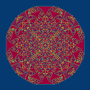

# cplus-sandpiles
sandpiles in c/c++ 

This appears to be about twice as fast as the Go version. 

## timing

- 2^8
  - 256 grains placed
  - Time 0h 0m 0s
  - 484:516 484:516
  - 32 32

- 2^9
  - 512 grains placed
  - Time 0h 0m 0s
  - 481:519 481:519
  - 38 38

- 2^10
  - 1024 grains placed
  - Time 0h 0m 0s
  - 478:522 478:522
  - 44 44

- 2^11
  - 2048 grains placed
  - Time 0h 0m 0s
  - 473:527 473:527
  - 54 54

- 2^12
  - 4096 grains placed
  - Time 0h 0m 0s
  - 466:534 466:534
  - 68 68

- 2^13
  - 8192 grains placed
  - Time 0h 0m 1s
  - 457:543 457:543
  - 86 86

- 2^14
  - 16384 grains placed
  - Time 0h 0m 2s
  - 443:557 443:557
  - 114 114

- 2^15
  - 32768 grains placed
  - Time 0h 0m 9s
  - 423:577 423:577
  - 154 154

- 2^16
  - 65536 grains placed
  - Time 0h 0m 34s
  - 396:604 396:604
  - 208 208

- 2^17
  - 131072 grains placed
  - Time 0h 2m 33s
  - 357:643 357:643
  - 286 286

- 2^18
  - 262144 grains placed
  - Time 0h 12m 31s
  - 303:697 303:697
  - 394 394

- 2^19
  - 524288 grains placed
  - Time 1h 63m?????? 49s
  - 225:775 225:775
  - 550 550

I dont trust the times now.

