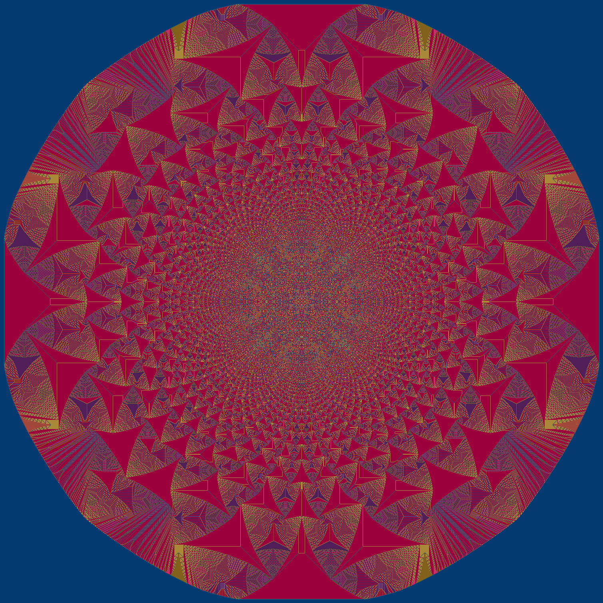

# cplus-sandpiles

I learned about a type of cellular automata called **sandpiles**. 

My first pass was to use my main language of Go but the performance was not what I wanted it to be. I ported it to c/c++ and got better performance but I knew it could be better but I put it on the back burner so I could concentrate on my other projects that make money. 

So here I am back to see what I can do.

Basic changes:

```
#define gsize uint32_t // fall back is uint16_t
#define pilehalf 2147483648 // fall back is 32768
```
    
This allows the code to be altered much easier. 

Had to place bounds on grains and piehalf.  
Works much faster now.

Switching from 8b to 16b to 32b allows more grains to be placed each round and that made it SO much faster.

I need to do some serious documentation, but have fun with it anyway. If you get larger images before I do, please do a pull request with the image so it can be included. I would like to see what piles above 1<<32 will look like.

Also, with a bit of code change, there can be multiple starting locations. It makes for some really interesting images.

Memory usage at 1<<20  
`568392 565604 2992`

Memory usage at 1<<21  
`568392 565700 3088`

I do not know what the bounds of the images will turn out to be so watch the output:
shift: 21  
grains: 2097152  
grid_X: 12000  
grid_Y: 12000  
grid_size: 144000000  
2^21
- 2097152 grains placed
- Time 2086
- 5464:6536 5464:6536
- 1072 1072

This image is 1072x1072 and the max at this time is 12000x12000. This value might need to be changed, but it will increase the amount of memory needed.


