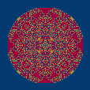
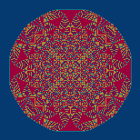
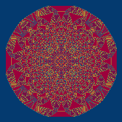
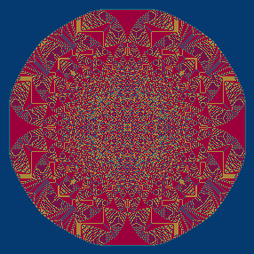
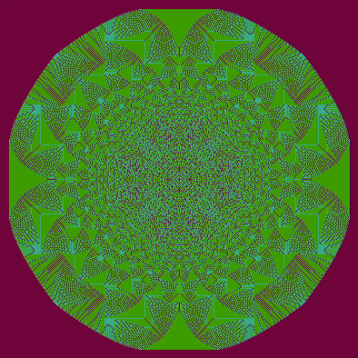
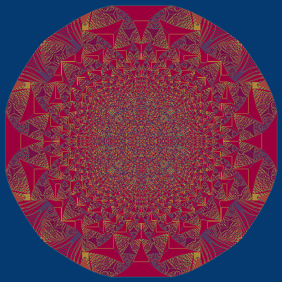
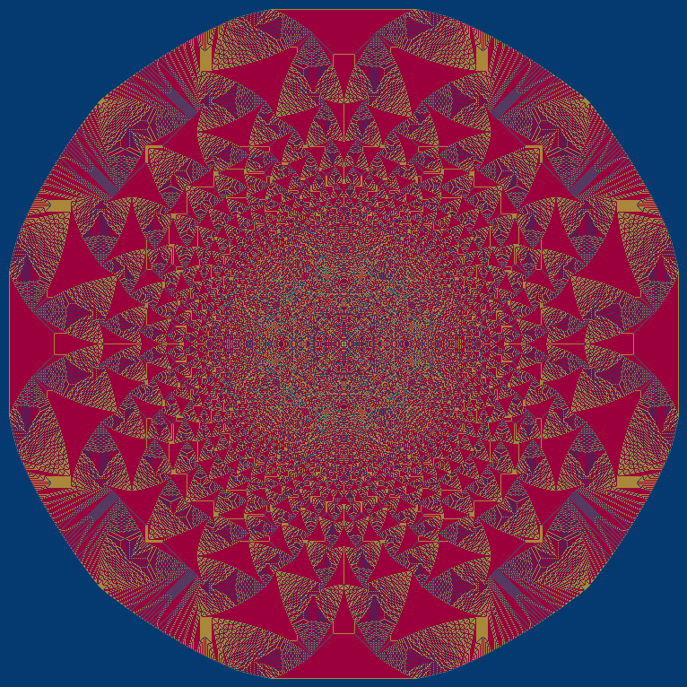
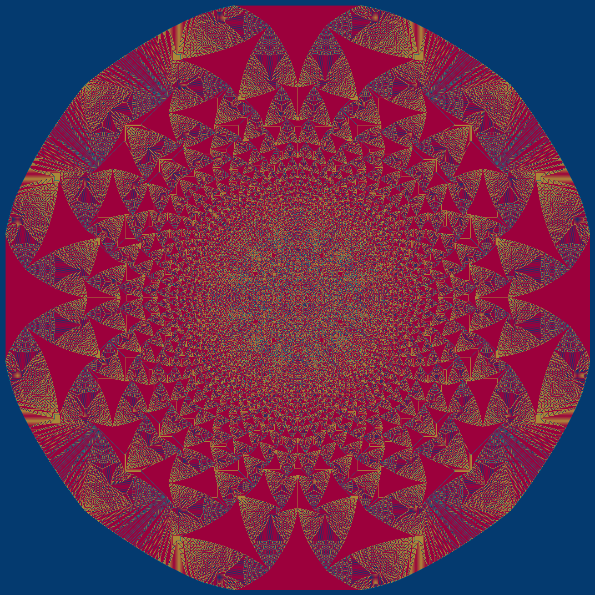

# cplus-sandpiles
sandpiles in c/c++ 

## new code - big dell laptop - 75% load

**2^8**
- 256 grains placed
- Time 0
- 1984:2016 1984:2016
- 32 32

**2^9**
- 512 grains placed
- Time 0
- 1981:2019 1981:2019
- 38 38

**2^10**
- 1024 grains placed
- Time 0
- 1978:2022 1978:2022
- 44 44

**2^11**
- 2048 grains placed
- Time 0
- 1973:2027 1973:2027
- 54 54

**2^12**
- 4096 grains placed
- Time 0
- 1966:2034 1966:2034
- 68 68

**2^13**
- 8192 grains placed
- Time 0
- 1957:2043 1957:2043
- 86 86

**2^14**
- 16384 grains placed
- Time 1
- 1943:2057 1943:2057
- 114 114

**2^15**
- 32768 grains placed
- Time 1
- 1923:2077 1923:2077
- 154 154

**2^16**
- 65536 grains placed
- Time 10
- 1896:2104 1896:2104
- 208 208

**2^17**
- 131072 grains placed
- Time 47
- 1857:2143 1857:2143
- 286 286

**2^18**
- 262144 grains placed
- Time 207
- 1803:2197 1803:2197
- 394 394

**2^19**
- 524288 grains placed
- Time 998
- 1725:2275 1725:2275
- 550 550

**2^20**
- 1048576 grains placed
- Time 5083
- 1617:2383 1617:2383
- 766 766

New machine
**2^21**
- 2097152 grains placed
- Time 39737
- 1464:2536 1464:2536
- 1072 1072

---

